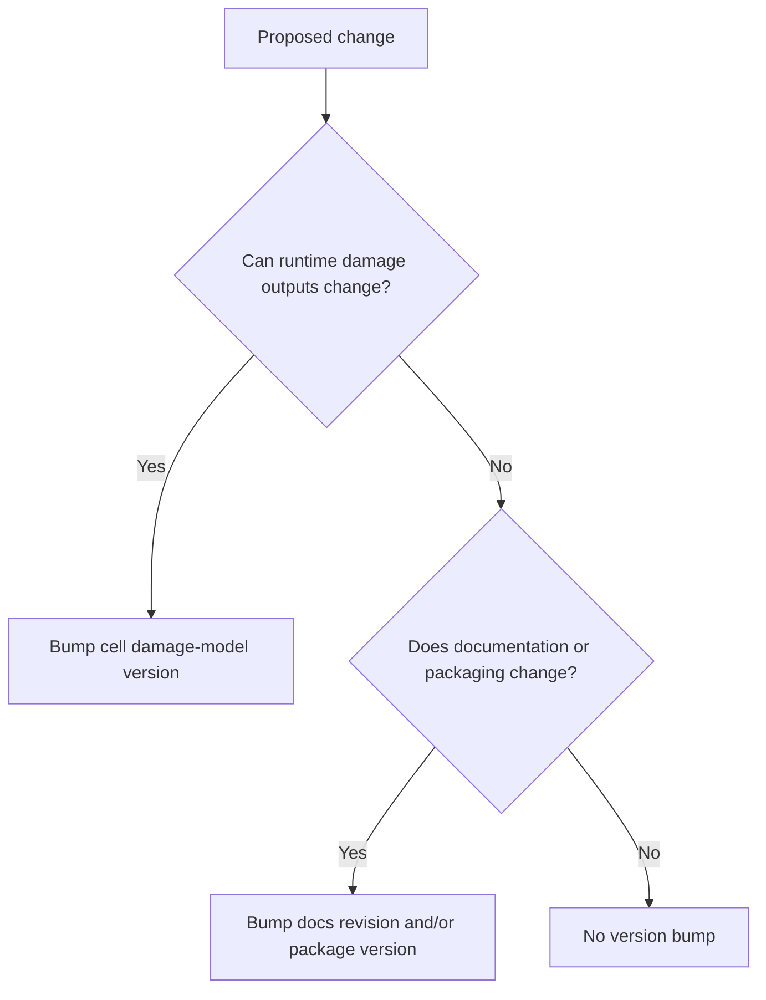

# 17 · Versioning policy — package releases vs damage-model versions

This document fixes an important naming problem: the library has had package releases, documentation
improvements, scaffold versions, and actual curve/model changes all using similar `vX.Y` language.
That can confuse reviewers.

Going forward, the library uses **separate version streams**.

```text
PACKAGE RELEASE VERSION
    changes when the zip package changes
    example: damage-curve library package v2.1

CELL DAMAGE MODEL VERSION
    changes only when runtime damage behavior changes
    example: HAIL_SOLAR damage model v1.0

CELL DOCUMENTATION REVISION
    changes when explanation, format, crosswalks, or proof trail improve
    example: HAIL_SOLAR docs r3

WORKBOOK / FILE REVISION
    optional file-management label for implementation artifacts
    example: damage_curve_records_hail_solar_model_v1_0_docs_r3.xlsx
```

The key rule:

```text
If the same inputs produce the same damage-code outputs, do not bump the cell damage-model version.
If the same inputs can produce different damage-code outputs, bump the cell damage-model version.
```

---

## 1. Why this matters

A reviewer expects a cell version to mean something like:

```text
HAIL_SOLAR v1.1 changed the damage model.
```

But some earlier labels changed because we added:

```text
- better folder structure,
- derivation-dossier detail,
- crosswalk files,
- global method standards,
- metadata explanations,
- dashboard previews.
```

Those are valuable changes, but they should not imply the curve itself changed.

So we separate:

```text
model version = damage behavior
package version = delivery bundle
revision = documentation / file management
```

---

## 2. Version streams

### 2.1 Package release version

The package release version is the version of the **whole zip**.

Bump it when:

```text
- a new global method document is added,
- a cell package is added,
- a cell current version changes,
- source context is reorganized,
- templates are improved,
- delivery structure changes,
- or any package content changes.
```

Example:

```text
DAMAGE_CURVE_LIBRARY_V2_1_EVIDENCE_UPDATE_AND_VERSIONING_DELIVERABLE.zip
```

A package version does **not** necessarily mean any curve changed.

---

### 2.2 Cell damage-model version

The cell damage-model version is the version of the actual damage behavior for one hazard × asset cell.

Bump it when any of these change:

```text
- failure-unit coverage that affects outputs,
- x-axis semantics,
- y-axis semantics,
- curve form,
- curve parameters,
- damage states or ordinates,
- selector logic that changes chosen curve,
- conditioner logic that changes curve output,
- exposure logic that changes output,
- value-concentration logic embedded in the damage-code layer,
- runtime output fields or meanings.
```

Do **not** bump it for:

```text
- better prose,
- new ASCII diagrams,
- added source links that do not affect adopted parameters,
- workbook formatting,
- renamed folders,
- package-level method updates,
- documentation crosswalk improvements.
```

---

### 2.3 Cell documentation revision

The documentation revision tracks improvement to explanation and auditability.

Bump it when:

```text
- a derivation dossier is clarified,
- source-to-parameter mapping is improved without changing the model,
- rejected alternatives are documented,
- metadata definitions are clarified,
- crosswalks or reviewer guides are added,
- format changes but outputs do not.
```

Example:

```text
HAIL_SOLAR damage model v1.0, docs r3
```

This says:

```text
The hail solar curve is still model v1.0.
The documentation has been improved three times.
```

---

### 2.4 Workbook/file revision

Workbook filenames are implementation artifacts. They may carry both the model version and documentation revision.

Recommended future pattern:

```text
damage_curve_records__hail_solar__model_v1_0__docs_r3.xlsx
hail_solar_curve_derivation_dossier__model_v1_0__docs_r3.md
```

This is verbose but unambiguous. Shorter aliases can point to the current file.

---

## 3. Semantic versioning for damage models

Use this pattern:

```text
model vMAJOR.MINOR.PATCH
```

### Major version bump

Use `v2.0` when there is a breaking or conceptually large change.

Examples:

```text
- hail x-axis changes from MESH diameter to impact-energy-native curve,
- flood changes from local-depth curves to a fully 2-D depth-duration model,
- wind/tornado cell splits into separate WIND_WIND and TORNADO_WIND cells,
- y-axis changes from replacement DR to performance-loss DR,
- runtime interface changes incompatibly.
```

### Minor version bump

Use `v1.1`, `v1.2`, etc. when behavior changes but the model remains compatible.

Examples:

```text
- add a hail-hardened module archetype with parameters,
- update D50 based on new lab/claims evidence,
- add a new flood equipment variant curve,
- add turbine parked-state conditioner that changes output,
- add a new primary failure-unit while preserving existing outputs.
```

### Patch version bump

Use `v1.0.1` for corrections or small changes.

Examples:

```text
- fix a formula implementation bug,
- correct unit conversion in an axis bridge,
- adjust an ordinate due to transcription error,
- correct a parameter copied incorrectly from the dossier.
```

If a patch changes numerical outputs, document it clearly and include an old-vs-new note.

---

## 4. Current semantic registry as of package v2.1

This table clarifies the current package labels versus actual model semantics.

| Cell | Current folder/file labels in package | Semantic damage-model version | Documentation revision status | Notes |
|---|---|---:|---|---|
| `hail_solar` | Many files still carry `v1_3` legacy labels | **model v1.0** | docs r3 | Curve parameters were established in the derived hail-solar work. Later v1.2/v1.3 package labels mainly improved structure, derivation audit, and documentation. |
| `flood_solar` | `v1_0` | **model v1.0** | docs r0/r1 | First derived multi-failure-unit flood model. |
| `wind_tornado_wind` | `v1_0` | **model v1.0** | docs r0/r1 | First derived repeated-unit structural wind/tornado model. |

The existing filenames are retained for continuity. Future packages should use the clearer naming policy.

---

## 5. What counts as a model change?

Use this decision tree:

```text
proposed update
      │
      ▼
Can damage-code outputs change for the same hazard + asset inputs?
      │
      ├─ yes
      │    └─ bump cell damage-model version
      │
      └─ no
           │
           ▼
Does explanation / organization / proof trail improve?
      │
      ├─ yes
      │    └─ bump documentation revision or package version only
      │
      └─ no
           └─ no version bump needed
```

Mermaid:



---

## 6. Examples

| Change | Version action |
|---|---|
| Add a new global guide on reference ingestion | Package version bump only. |
| Add a better hail derivation explanation, no parameter changes | HAIL_SOLAR docs revision only. |
| Add source links to hail dossier, no parameter changes | Docs revision only. |
| Change hail default D50 from 52.7 mm to 50.0 mm | HAIL_SOLAR model minor/patch bump. |
| Add a new module archetype curve | HAIL_SOLAR model minor bump. |
| Rename workbook sheets but formulas unchanged | Package/docs revision only. |
| Fix workbook formula that previously produced wrong DR | Model patch bump and issue note. |
| Add flood duration as a second axis | FLOOD_SOLAR model major or minor depending compatibility. |
| Add proprietary claims data to evidence backlog but do not adopt it | Evidence log/docs update only. |
| Adopt proprietary claims data into curve parameters | Model version bump. |

---

## 7. Recommended future folder labels

Future cell folders can stay clean:

```text
docs/cells/hail_solar/current/
    README.md
    damage_code_metadata_spec.md
    curve_derivation_dossier.md
    damage_curve_records.xlsx
    VERSION.md
```

Inside `VERSION.md`:

```text
cell_id: HAIL_SOLAR
model_version: 1.0
docs_revision: 3
package_release_first_current: 2.1
last_model_change: derived hail module curve
last_docs_change: versioning/evidence protocol cross-reference
```

If file names need version labels, use:

```text
hail_solar__model_v1_0__docs_r3__damage_curve_records.xlsx
```

---

## 8. Archive policy

When a cell damage model changes:

```text
1. Move the old current files into archive/model_vX_Y/.
2. Add an update memo explaining old vs new.
3. Update VERSION.md.
4. Update the root VERSION_REGISTRY.md.
5. Keep old dashboards if they help compare outputs.
```

When only documentation changes:

```text
1. Keep model archive unchanged.
2. Update docs revision.
3. Add note to VERSION.md and root VERSION_REGISTRY.md.
4. Package version may change.
```

---

## 9. Final rule

```text
Package versions tell users which zip they downloaded.
Documentation revisions tell users how polished the proof trail is.
Damage-model versions tell users whether the damage code behavior changed.
```

Do not use one number to mean all three.
