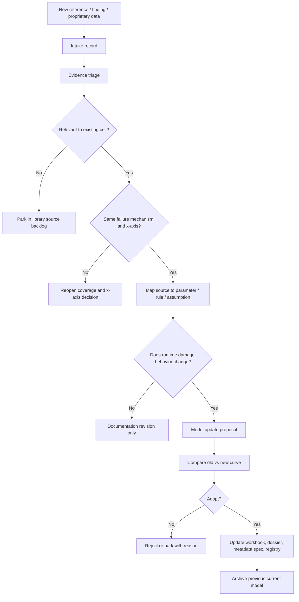

# 16 · Reference ingestion and curve-update protocol

This document defines how the damage-curve library should absorb **new evidence**: public reports,
research papers, standards, lab-test results, vendor documentation, insurer/claims studies,
engineering calculations, proprietary datasets, and post-event forensic findings.

The purpose is to make curve improvement repeatable and auditable. A future reviewer should be able
to answer:

```text
What new source arrived?
What did it actually support?
Which curve field or assumption did it affect?
Was it adopted, parked, rejected, or used only qualitatively?
Did the damage model version change?
Did only the documentation revision change?
```

The core rule is simple:

```text
A reference is input, not authority.
A source earns a role in the curve only after it is mapped to a mechanism, x-axis, failure-unit,
parameter, selector, conditioner, exposure variable, or assumption.
```

---

## 1. Where this protocol fits in the architecture

```text
NEW EVIDENCE / REFERENCE
        │
        ▼
INTAKE RECORD
        │
        ▼
EVIDENCE TRIAGE
        │
        ├─ relevant to this cell?
        ├─ relevant to this failure-unit?
        ├─ same x-axis or bridge needed?
        ├─ supports parameter, curve form, selector, conditioner, exposure, or only direction?
        └─ conflicts with current model?
        │
        ▼
IMPACT ASSESSMENT
        │
        ├─ no model impact: add to notes / bibliography
        ├─ open seam support: add to assumption register
        ├─ documentation improvement only: docs revision
        ├─ parameter / curve / runtime behavior change: model version bump
        └─ new mechanism: coverage/x-axis revisit before curve update
        │
        ▼
CURVE UPDATE DECISION
        │
        ▼
UPDATED WORKBOOK + DERIVATION DOSSIER + VERSION REGISTRY
```

Mermaid version:



---

## 2. The evidence intake record

Every new source should first get an intake row before anyone edits a curve.

Minimum intake fields:

| Field | Meaning |
|---|---|
| `evidence_id` | Stable identifier, e.g. `HAIL_SOLAR_SRC_2026_001`. |
| `cell_id` | Candidate hazard × asset cell, e.g. `HAIL_SOLAR`, `FLOOD_SOLAR`, `WIND_TORNADO_WIND`. |
| `source_title` | Human-readable title. |
| `source_type` | Empirical claims, lab test, standard, analytical model, vendor note, forensic case, expert judgment, etc. |
| `source_link_or_pointer` | URL, DOI, internal document pointer, or proprietary-data reference. |
| `access_status` | Public, licensed, confidential, internal, redacted. |
| `date_accessed_or_received` | When this source was reviewed. |
| `candidate_failure_units` | Which failure-units it may affect. |
| `candidate_x_axis` | Hazard axis used by the source. |
| `source_native_units` | Units used by the source. |
| `summary_of_relevant_finding` | Short summary in our words. |
| `proposed_use` | Parameter anchor, curve form, selector rule, conditioner rule, exposure logic, open seam, background only. |
| `initial_disposition` | Adopt, evaluate, park, reject, duplicate, superseded. |
| `review_notes` | Why. |

For proprietary evidence, never paste restricted raw data into public/shared packages. Store:

```text
source_link_or_pointer = internal secure pointer
public_summary = redacted summary of what the evidence supports
access_status = confidential / licensed / internal
```

The derivation dossier can still say, for example:

```text
A proprietary claims dataset supports raising the large-loss tail for WT_TOWER_STRUCT,
but the raw claims table is not redistributed in this package.
```

---

## 3. Evidence classes and what they can support

Not all sources are allowed to do the same job.

| Evidence class | Strongest use | Common limitation |
|---|---|---|
| Empirical claims / loss data | Calibrating loss severity and validating full curve behavior | Coverage, reporting bias, basis ambiguity, claim-set confidentiality. |
| Post-event forensic studies | Mechanism confirmation and high-severity anchors | Usually sparse; often one event or one asset configuration. |
| Lab / test data | Controlled failure thresholds and selector effects | May not represent field installation, swath exposure, aging, or operations. |
| Standards / design codes | Boundary conditions, pass/fail thresholds, design selectors | Standards are anchors, not full damage curves. |
| Analytical / physics models | Curve shape, scaling, extrapolation, bridge variables | Need validation; may be sensitive to assumptions. |
| Vendor documentation | Asset metadata, operating states, protection features | Marketing bias; may not provide failure probabilities. |
| Expert judgment | Fills explicit gaps when nothing better exists | Must be labeled, bounded, and replaceable. |

The source-to-parameter mapping should state the **role** of the source:

```text
source supports an anchor
source supports curve-form choice
source supports a direction of adjustment
source supports a selector category
source supports a conditioner mechanism
source supports exposure logic
source only supports background context
```

A source that supports a direction does not automatically support a numeric parameter.

Example:

```text
"Tracker hail stow reduces module exposure" supports the direction of a stow adjustment.
It does not, by itself, prove that D50 should shift by exactly +8 mm.
```

---

## 4. The source-to-parameter mapping

Every adopted source must map to a specific part of the model.

```text
SOURCE
  → evidence claim
  → interpreted model role
  → affected field / parameter
  → confidence tier
  → caveat
```

Example mapping table:

| Source | What it says | Model role | Affected item | Strength |
|---|---|---|---|---|
| Lab hail-test report | 3.2 mm glass/backsheet has lower breakage than 2.0 mm glass/glass at 50 mm hail | Selector / archetype support | `module_archetype` curves | Medium-high |
| Flood electrical guidance | Water-damaged electrical equipment may need replacement or reconditioning | Damage-state support | Flood electrical piecewise curves | Medium |
| Wind turbine design standard | Turbine class defines extreme wind design context | Selector / normalization | `Ve50_class`, IEC class selector | High for design context |
| Tornado case study | EF4 event downed turbines | High-severity case evidence | Tornado direct-hit variant / open seam | Low-medium for curve calibration |

If the mapping is not clear, do not use the source to move a curve. Park it as background or open-seam evidence.

---

## 5. Axis compatibility check

Before adopting any source, ask whether its x-axis matches the current damage-code axis.

```text
current curve axis
   │
   ├─ same as source axis
   │     └─ source can map directly
   │
   ├─ source axis is bridgeable
   │     └─ create or update Axis_Bridge with assumptions
   │
   └─ source axis measures a different mechanism
         └─ do not force it into the curve; reopen x-axis decision
```

Examples:

| Cell | Current axis | New source axis | Treatment |
|---|---|---|---|
| Hail × solar | MESH-equivalent hail diameter | Per-stone impact kinetic energy | Bridge via diameter-to-KE assumptions if source supports it. |
| Flood × solar | Local depth above component datum | Site-wide flood depth above grade | Convert using component elevation; do not apply directly to all components. |
| Wind/tornado × wind | Hub-height 3-sec gust / EF bridge | 10 m sustained wind | Bridge using wind-profile and gust-factor assumptions, or park if not reliable. |

Axis mismatch is one of the most common ways a curve becomes falsely precise.

---

## 6. Impact assessment: what kind of update is this?

A new reference can affect the library in many different ways.

| Update type | Does model version change? | Example |
|---|---:|---|
| Bibliographic / context only | No | Add a helpful report link that does not affect parameters. |
| Derivation explanation improved | No; docs revision only | Add clearer proof trail for existing fit. |
| Open-seam support | Usually no, until adopted | Add proprietary stow-event data as candidate evidence. |
| Parameter update | Yes | Change hail curve D50 or flood state ordinates. |
| Curve-form update | Yes, usually major/minor | Change logistic hail curve to empirical table. |
| New selector / conditioner that changes output | Yes | Add a new module archetype or turbine parked-state variant. |
| Coverage-map change | Yes | Add a new primary failure-unit. |
| Value-basis or f_kind clarification only | Maybe docs revision; model change if runtime output changes | Correct labeling vs change calculation. |
| Workbook formatting / package organization | No model version change | Add better crosswalk or dashboard. |

The rule:

```text
If the damage code output can change for the same inputs, bump the damage model version.
If only the explanation or packaging improves, bump only the documentation/package revision.
```

---

## 7. New curve vs adjustment vs exposure scaling

When new evidence arrives, do not automatically create a new curve.

```text
Create a NEW curve when:
    the physical failure mechanism or material/equipment construction is distinct,
    the affected value bucket is material,
    and the evidence supports different parameters or states.

Adjust an existing curve when:
    the mechanism is the same,
    but resistance, angle, operating state, or protection changes vulnerability.

Use exposure/value scaling when:
    the curve is the same,
    but less of the value bucket is exposed.
```

Examples:

| New finding | Treatment |
|---|---|
| Hail-hardened module test shows lower breakage at same diameter | New module-archetype curve or horizontal shift. |
| Tracker stow reduces effective hail impact angle | Conditioner adjustment / blend. |
| Hail swath hits only 40% of array | Exposure multiplier, not new curve. |
| Inverter and switchgear have different inundation replacement behavior | Separate failure-unit curves. |
| Substation is elevated above flood depth | Exposure/local-depth adjustment, not new curve. |
| Tornado direct-hit case shows tower collapse at high EF range | Tornado variant/direct-hit pathway, not generic straight-line wind calibration alone. |

---

## 8. Conflict handling

New sources will conflict. The library should not hide that.

Use this procedure:

```text
1. Confirm same failure-unit, x-axis, unit, and basis.
2. Check whether the sources apply to different selectors or conditioners.
3. Check whether one source is lab/test and the other is field/claims.
4. Check age, sample size, geography, asset vintage, and reporting bias.
5. Decide whether the conflict implies:
      a) one source is out of scope,
      b) a new selector/variant is needed,
      c) a spread/distribution is needed,
      d) or the curve should not yet be updated.
6. Document the conflict and disposition.
```

Do not average conflicting sources unless they truly measure the same thing on the same axis and basis.

---

## 9. Proprietary evidence handling

Proprietary evidence is often the best curve-improvement source, but it can damage auditability if handled casually.

Rules:

```text
- Store raw proprietary files outside the distributable package unless permitted.
- Give each source a stable internal evidence ID.
- Record what model element it supports without exposing restricted contents.
- Separate public-source fit from proprietary override where possible.
- Keep a redacted derivation summary in the cell dossier.
- Version-bump the model if proprietary data changes output.
```

Recommended notation:

```text
source_id: PROP_HAIL_SOLAR_CLAIMS_2026_001
access_status: confidential_internal
raw_pointer: secure://claims/hail_solar/2026_001
public_summary: "Supports higher loss frequency above 50 mm MESH for thin glass modules."
affected_parameters: D50_fragile, k_fragile, cap-binding assessment
adoption_status: adopted_parameter_update
```

---

## 10. The curve update memo

Any adopted model-changing evidence should have a short update memo.

Minimum sections:

```text
1. Summary of proposed update
2. Source inventory
3. Source-to-parameter mapping
4. Previous curve / parameter values
5. New curve / parameter values
6. Old-vs-new plots
7. Impact on selectors / conditioners / exposure variables
8. Impact on value link and cap_L
9. Version bump recommendation
10. Open seams and reviewer notes
```

This memo can live in the cell folder, or as a tab/sheet in the workbook, but it should be easy to find.

---

## 11. Workbook update locations

When adopting new evidence, update the relevant workbook sheets.

| Workbook area | Update when |
|---|---|
| `Evidence_Log` / `Sources` | Any source is added. |
| `Evidence_Params` | Source affects parameter, threshold, curve form, or adjustment logic. |
| `Base_Curve_Fit` | Curve parameters, anchors, or curve form change. |
| `Adjustment_Rules` | Selector/conditioner/exposure transformations change. |
| `Variant_Catalog` | New variant or archetype is added. |
| `Assumption_Register` | New assumption, changed assumption, or retired assumption. |
| `Open_Seams` | New unresolved issue or retired seam. |
| `QA_Checks` | Any model-changing update. |
| `Dashboard` | If old-vs-new or scenario plots should show effect. |

---

## 12. Documentation update locations

Update the cell documents in this order:

```text
1. Derivation dossier
   - source-to-parameter mapping
   - curve form / anchor update
   - assumption register
   - old-vs-new rationale

2. Metadata spec
   - only if selectors, conditioners, exposure variables, or outputs change

3. README
   - summarize current model version and what changed

4. Crosswalk
   - if files or required sections changed

5. Version registry
   - always for any adopted update
```

---

## 13. Acceptance gates before adoption

A source should not change a curve until these checks pass:

```text
RELEVANCE CHECK
  The source is actually about the same failure mechanism or a documented variant.

AXIS CHECK
  The source x-axis is same, bridgeable, or intentionally different.

BASIS CHECK
  The damage metric is understood: replacement cost, performance loss, failure probability,
  claim severity, damage state, or something else.

PARAMETER CHECK
  The source maps to a specific parameter, anchor, state, selector, conditioner, or exposure rule.

CONFLICT CHECK
  Conflicting evidence is acknowledged.

IMPACT CHECK
  Old-vs-new curve effect is shown or summarized.

VERSION CHECK
  Correct model/package/docs version change is selected.

TRACEABILITY CHECK
  Link/pointer and adoption rationale are in the package.
```

---

## 14. Final principle

The curve library should get better when new information arrives, but it should not become unstable.

```text
Do not update curves because a new source sounds authoritative.
Update curves because a new source improves a specific, traceable part of the damage-code record.
```
