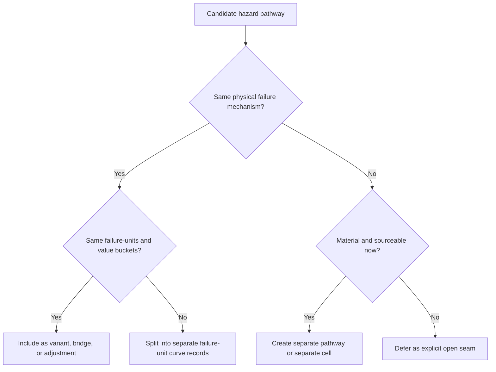

# 18 · Hazard-pathway scope splitting standard

**Purpose:** prevent a cell name from silently forcing the wrong physics.
**Status:** global method standard added in package `v2.3`.
**Core idea:** the same hazard family can be scoped differently by asset because the failure mechanisms and evidence base differ.

This document exists because `wind/tornado × wind farm` and `strong wind × solar` look similar at the hazard label level, but they should not automatically receive the same treatment.

```text
same hazard family
   ≠ same cell scope
   ≠ same x-axis bridge
   ≠ same failure-unit coverage
   ≠ same curve form
```

The global architecture remains consistent. The physics does not have to be flattened.

---

## 1. One-screen rule

| Question | If yes | If no |
|---|---|---|
| Does the hazard pathway damage the same failure-units through the same mechanism? | It can live in one cell/pathway. | Split or defer. |
| Does it use the same operational x-axis or a clean bridge? | Keep same curve family or variant. | Create a separate pathway or x-axis record. |
| Does it introduce a material new damage mechanism? | New curve or deferred subpathway. | Adjustment may be enough. |
| Does evidence support fitting the pathway now? | Build it. | Park as explicit open seam. |
| Would including it confuse the v1 scope? | Split / defer. | Include with clear labels. |

The principle:

```text
Combine pathways when they share failure-units and mechanism.
Separate pathways when the hazard label hides a different mechanism.
Defer pathways when they are real but not yet sourceable enough for v1.
```

---

## 2. Why this matters

A broad hazard label like `wind`, `flood`, `fire`, or `winter storm` often contains multiple physical pathways.

```text
wind
├─ straight-line gust loading
├─ hurricane gust loading
├─ tornado pressure / direct-hit loading
├─ windborne debris / missile impact
├─ wind-driven rain
└─ consequential damage from failed structures
```

If we collapse all of that into one curve too early, we create an impressive-looking curve that is not auditable. Instead, each cell should declare:

```text
primary pathway in v1
deferred pathways
separate variants
rejected alternatives
```

---

## 3. Example — wind/tornado × wind farm versus strong wind × solar

### Wind/tornado × wind farm

For a wind farm, the primary structural failure-units remain largely the same across severe straight-line wind and tornado proxy loading:

```text
wind/tornado × wind farm
├─ ROTOR_ASSEMBLY / BLADE
├─ TOWER / TOWER_SECTION
├─ NACELLE / drivetrain-generator-housing
└─ FOUNDATION / support / overturning
```

The tornado pathway is still explicitly caveated because EF-scale wind is a damage-estimated proxy, not direct measured turbine-level wind. But it can live in the same cell because the major damaged turbine units are the same and the current v1 curve can treat tornado as a separated direct-hit / proxy variant.

```text
severe wind speed / EF proxy
      │
      ▼
design-normalized structural demand
      │
      ├─ blade curve
      ├─ tower curve
      ├─ nacelle curve
      └─ foundation curve
```

### Strong wind × solar

For solar PV, tornado can add mechanisms that are not just stronger straight-line wind:

```text
tornado × solar
├─ aerodynamic uplift on trackers / racking / modules
├─ tracker row torsion / torque-tube failure
├─ pile uplift / pullout
├─ module detachment / clamp failure
├─ debris / missile impact
├─ narrow-swath partial-array destruction
├─ inverter / combiner / SCADA debris damage
└─ substation / fencing / civil damage if footprint intersects
```

So the first solar wind cell should be narrower:

```text
strong wind × solar v0.1
├─ primary pathway:
│  └─ straight-line / hurricane / derecho gust loading
│
└─ deferred pathway:
   └─ tornado-specific debris / EF-swath damage
```

This does **not** mean tornado is irrelevant to solar. It means tornado is a separate or deferred pathway until its debris/swath mechanism is explicitly modeled.

---

## 4. ASCII decision tree

```text
candidate hazard pathway
      │
      ▼
Does it share the same physical failure mechanism as the main pathway?
      │
      ├─ yes
      │     ▼
      │  Does it share the same failure-units and value buckets?
      │     │
      │     ├─ yes → include as variant / bridge / adjustment
      │     └─ no  → split into separate failure-unit curve(s)
      │
      └─ no
            ▼
         Is it material and sourceable now?
            │
            ├─ yes → separate pathway or separate cell
            └─ no  → defer explicitly as open seam
```

---

## 5. Mermaid flow



---

## 6. Naming guidance

Use the narrowest name that is still honest.

| Bad / too broad | Better |
|---|---|
| `wind × solar` | `strong_wind_solar` for straight-line gust loading |
| `tornado × solar` mixed silently into wind | `tornado_solar` or `tornado_pathway_deferred` |
| `flood × solar` with one plant curve | `flood_solar` with depth-driven electrical and velocity/scour pathways |
| `storm × solar` | split into wind, flood, hail, lightning, wildfire, etc. |

Recommended labels:

```text
cell_id:
    STRONG_WIND_SOLAR

primary_pathway:
    straight_line_gust_loading

deferred_pathways:
    tornado_debris_swath
    wind_driven_rain_electrical_ingress
    combined_hail_wind
```

---

## 7. How to document deferred pathways

A deferred pathway is not a missing thought. It is an explicit v1 boundary.

Every deferred pathway should carry:

```text
pathway_id
why real
why not in v1
likely failure-units
candidate x-axis
evidence needed
whether it is separate cell or future variant
```

Example:

```text
pathway_id: TORNADO_SOLAR_DEBRIS_SWATH
why_real: tornadoes can cause narrow-swath destruction and windborne debris impact
why_not_v0_1: debris and EF proxy pathways require separate evidence and coverage logic
likely_failure_units:
  - PV_MODULE debris impact / detachment
  - RACKING_STRUCTURE collapse
  - FOUNDATION pullout
  - INVERTER / SCADA debris damage
candidate_x_axis:
  - EF-scale proxy
  - maximum tornado wind proxy
  - debris impact / missile proxy
decision:
  defer from strong_wind_solar v0.1; decide later whether separate cell
```

---

## 8. Standard language for future cells

Every cell README should include a section like:

```text
Scope note:
    This cell models [primary pathway].
    It does not yet model [deferred pathway].
    The deferred pathway is real, but it introduces [different failure mechanism],
    so it is tracked as [open seam / future variant / separate cell].
```

For `strong_wind_solar`:

```text
Scope note:
    This v0.1 cell models straight-line / hurricane / derecho-style gust loading on
    utility-scale solar PV mounting, racking, modules, and foundations. Tornado-specific
    debris / missile / narrow-swath destruction is explicitly deferred because it adds
    mechanisms that are not just stronger straight-line wind.
```

---

## 9. Anti-patterns this standard prevents

| Anti-pattern | Why it is bad |
|---|---|
| Reusing a wind-farm tornado treatment for solar without review | Solar has different failure-units and debris pathways. |
| Treating tornado as just a larger gust everywhere | Tornado damage may include debris, narrow swath, pressure changes, and nonuniform footprint. |
| Creating a separate cell for every minor variant | Over-fragments the library. |
| Combining all storm impacts into one curve | Destroys mechanism traceability. |
| Hiding deferred pathways | Makes v1 look more complete than it is. |

---

## 10. Review checklist

Before accepting a cell scope:

```text
[ ] Primary pathway is named.
[ ] Deferred pathways are named.
[ ] Combined pathways share failure-units and mechanisms.
[ ] Split pathways have a clear reason.
[ ] Rejected alternatives are documented.
[ ] The x-axis supports the chosen pathway.
[ ] The damage-code interface does not require unmodeled inputs.
[ ] The open-seam register includes any real but deferred pathways.
```

The format is supportive, not restrictive: if a future cell needs a different structure, document why and move forward.
