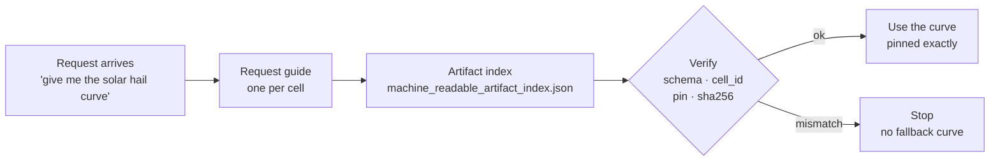
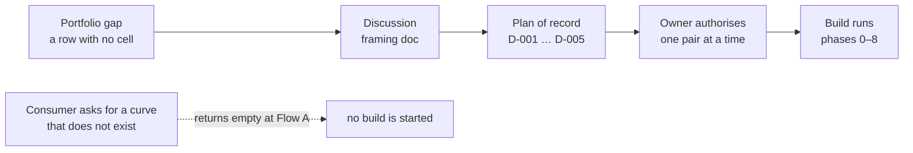
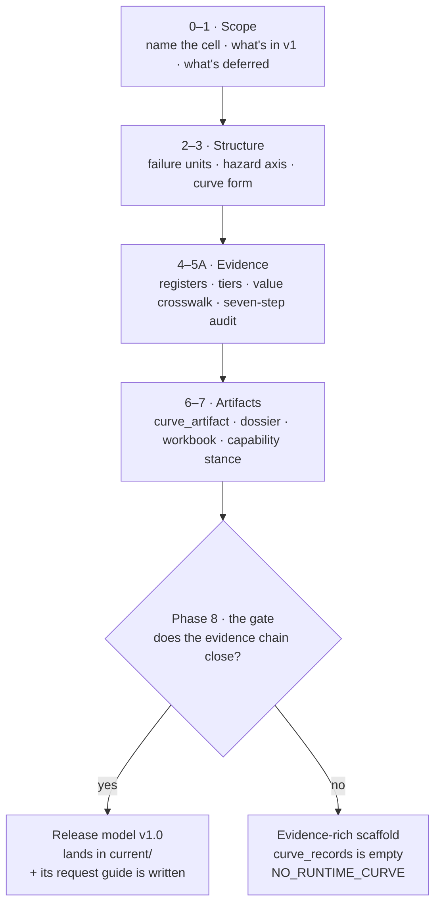
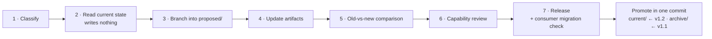
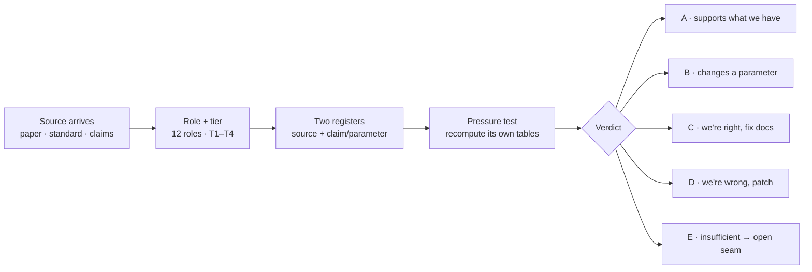
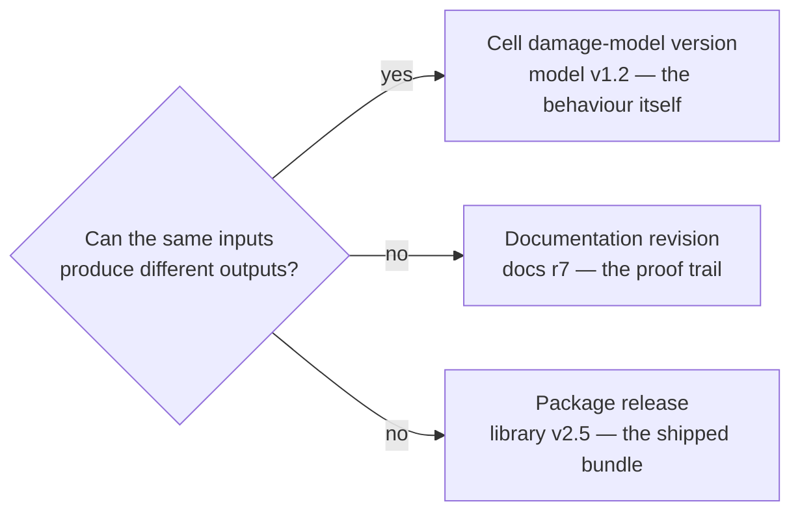

# Damage Modeling — Architecture & Flow

*A walkthrough of the current `aamani-ai/Damage_Modeling` repo (local working copy `~/Desktop/Damage_M`).*

*Written 2026-08-18. The Damage repo was read at commit `9009770` ("Correct Hurricane wind proxy to tower value"). All references to the Hazard repo were checked against the **remote deploy branch** `origin/deploy/hazard-grid-qc` (latest commit 2026-08-18), which is ahead of `main` and is the up-to-date picture of the consumer side.*

*Verification note — what was checked directly vs. summarized: the folder structures, the git log (including the commit dates and file counts in the Part III.2 trace), the cell-folder layouts, the test/CI/notebook inventory behind Part IV, and the Hazard deploy branch's consumer code (`origin/deploy/hazard-grid-qc`: the loader and registrar docstrings quoted in Part I §3.4) were **read directly**. The workflow steps, standards content, phase definitions, and template inventories in Parts I–III are **summarized from the repo's own documents** (quoted rules taken verbatim). The verbatim changelog entry and old-vs-new table in Part II are direct reads from the hurricane cell's records.*

This document answers:

1. What is Damage Modeling, and where does it sit among the three repos? (Part I §0)
2. How does an agent or human navigate the repo on first entry? (Part I §1)
3. Through what process, when, and how are files and folders created? (Part I §2)
4. What triggers a curve, and how does the Hazard repo pick it up? (Part I §3)
5. How does a consumer request an existing curve? (Part II · Flow A)
6. How is a curve built for a brand-new hazard × asset pair? (Part II · Flow B)
7. How does a curve that already exists get updated? (Part II · Flow C)
8. How does evidence come in — and when does it actually change the model? (Part II · Flow D)
9. How does versioning work, and where is every change written down? (Part II · the version convention)
10. For any file in a cell: what created it, and who reads it later? (Part III §III.1 — the lifecycle map)
11. Has the system actually worked under load? (Part III §III.2 — the hurricane trace)
12. Where does the repo stand today, and what is still missing? (Part IV)

---

# Part I · The repo and how to work in it

## 0 · What this repo is

Damage_Modeling answers one question: **if a hazard hits an asset with a certain intensity, what fraction of the asset's value is destroyed?** That fraction is called a damage ratio, and the function that produces it is a damage curve.

The repo sits between two things:

- **Upstream:** evidence — engineering papers, lab tests, industry standards — about how equipment fails.
- **Downstream:** the Hazard repo, whose M3 stage takes the curve and combines it with event frequency to compute annual losses (EAL, PML, and so on).

Two boundaries matter and are stated everywhere in the repo:

1. **Damage owns the curve; Hazard owns the money math.** This repo never computes EAL, PML, or portfolio numbers. It hands over a curve and stops.
2. **The curve covers physical destruction only** — repair cost divided by replacement value. Downtime and lost revenue are a separate stage, handled elsewhere.

The work is organized around a simple hierarchy:

- A **cell** is one hazard × asset pair (for example, hurricane wind × wind farm). It's the project-management unit.
- Inside a cell, each **failure unit** is one thing that can break (a turbine tower, a solar module). Each failure unit gets its own curve. This is the atom of the whole system.
- Total damage is just the sum: each failure unit's damage ratio times the value of the equipment it applies to. Things that don't break get an explicit "damage ≈ 0," not silence.

The repo currently holds eight cells at released model versions. It is a docs-first repo: the documents *are* the product, and the runtime deliverable is a small JSON file per cell.

### 0.1 The three-repo triangle

One line each, and who calls whom:

- **Damage Modeling** (this repo) = *the curve library with a chain of custody*. It publishes curves; it calls no one.
- **Hazard Modeling** = *the calculator and the screen*. It reads Damage's published curves (pinned by checksum), combines them with event frequency, and computes and displays the money numbers.
- **Resiliency Modeling** = *the lab notebook and experiment director* for protective measures. It **pins** Damage's curves by hash and may exercise adjustments Damage has already declared — but if a measure needs a genuinely *new* damage response, Resiliency files a request and **Damage builds, versions, and publishes it**; Resiliency waits. That boundary lives in `docs/contracts/resiliency_handoff/`.

So Damage sits upstream of both consumers: Hazard reads it for baseline risk, Resiliency reads it (through Hazard's engine) for with-measure scenarios, and neither may modify or reinterpret a curve — they consume exactly what was published, or refuse.

### 0.2 Terms used throughout

| Term | Plain meaning |
|---|---|
| **Damage ratio (DR)** | The fraction of a thing's value destroyed at a given hazard intensity |
| **Pin** | Referring to an artifact by exact version *and* SHA-256 checksum — never "the latest" |
| **KAT** (known-answer test) | A stored input→output pair; the consumer re-runs it at load time to prove the curve evaluates identically |
| **Capability declaration** | A per-curve statement of which metrics it may legally be used for; anything unsupported is *withheld* |
| **Withheld** (vs. caveated) | An unsupported number is *not published at all* — never published with a warning label |
| **Scaffold** | A cell with the full evidence package but zero runtime curves — honest coverage without a number |
| **Cap-binding** | The check that a curve's worst case can't claim more value than the evidence covers |
| **Promotion** | The atomic move of a proposal into `current/` (old version → `archive/`), all records in one commit |
| **Selector / conditioner** | Selector = picks a curve variant from fixed asset attributes; conditioner = adjusts a curve for event-time state |

---

## 1 · How an agent navigates the repo on first entry

There is one intended path in, and every document on it points to the next one.

**Step 1 — `CLAUDE.md`.** Nearly empty. It only imports `AGENTS.md`, so the two files can never drift apart.

**Step 2 — `AGENTS.md`.** The orientation document. It tells a new agent what the repo is, what it owns and doesn't own, the cell / failure-unit hierarchy, a map of every folder, and the house conventions. It also carries three practical warnings that save real time:

- Validator scripts need the repo's Python 3.12 virtualenv (`.venv/bin/python`). A system `python3` can fail with a misleading "No module named expat" error when reading the Excel workbooks.
- The `outputs/` folder is disposable and not in git. The real workbooks always live inside `docs/cells/<cell>/`.
- Before syncing with GitHub, check which side is newer. Agent runs write straight into the local tree, so the local copy is often *ahead* of the remote with uncommitted work — the right move can be commit-and-push, not pull.

`AGENTS.md` ends its opening banner with an explicit instruction: **start at `docs/scope/SCOPE_AND_STORY.md`.**

**Step 3 — `docs/scope/SCOPE_AND_STORY.md`.** The anchor document. It explains the reasoning behind the repo so nobody has to re-argue the boundaries: why damage was split out of Hazard, which of three phases the work is in, exactly where the line sits between Damage, Hazard, and Resiliency, and what is still open or parked.

**Step 4 — `docs/README.md`.** Fans out to the six main documentation areas: `scope/` (the anchor), `cells/` (the actual curve packages), `contracts/` (what the consumer relies on), `method/` (how curves must be built), `evidence/` (how references are ingested), and `source_drops/` (where external ZIPs land).

**Step 5 — folder READMEs.** Every folder has a README that acts as an index, never as content. Newer indexes also carry a small header (author, dates, status) and a ledger table of what's inside.

Once oriented, an agent finds the right document by task type:

| If the task is… | …the repo routes you to |
|---|---|
| Building a new cell | the cell-package standard (`docs/method/standards/02_cell_package_standard.md`) plus templates in `docs/method/templates/` |
| Using an existing curve | that cell's "curve request guide" in `docs/extra/guides/` — one exists per cell, and a test suite checks they stay accurate |
| Adding evidence | `docs/evidence/` and the reference-ingestion protocol (standard 16) |
| Changing a contract or schema | `docs/contracts/` — the numbered standards, the JSON schemas, and the handoff folders for Hazard and Resiliency |
| Ingesting an external ZIP | the source-drop ingestion guide in `docs/extra/guides/` |
| Making any governed curve change | the damage-curve skill bundle at `docs/extra/damage_curve_skill/` and its usage guide |
| A versioning question | the versioning policy (standard 17) — see Part II, "The version convention" |
| Releasing / publishing | `docs/guides/releasing_a_damage_artifact.md` — the step-by-step release runbook |

Each cell also has a `basics/` folder with three short reader pages — "what is this," "how the model was built," and "the exact reference tables" — so someone can understand a cell without opening the full governance trail.

---

## 2 · How, when, and through what process files and folders are created

Nothing in this repo is created casually. Every change goes through the same front gate, and the gate decides which files get made.

### 2.1 The front gate

The gate is the **damage-curve governance skill** (`docs/extra/damage_curve_skill/SKILL.md`). Any agent making a change first does two things:

1. **Pick a mode.** Working inside this repo → edit the canonical folders directly. Working outside it → produce a ZIP package and bring it in through the source-drop process. (The rule: never route in-repo work through a ZIP.)
2. **Classify the change.** A classifier document sorts every request into one of seven types — docs only, evidence only, model behavior change, new cell scaffold, new cell model release, schema/contract change, or packaging only. The type selects a written workflow, and the workflow says exactly which files to create, from which templates.

This is why the repo looks so uniform: the templates (about thirty of them across the two template folders, `docs/extra/damage_curve_skill/templates/` and `docs/method/templates/`) are the only way files come into existence.

### 2.2 The five creation pathways

Five pathways cover everything that gets created. The mechanics of the first, second, and fourth are Part II's flows — the detail lives there, once; this table is just the router:

| Pathway | Trigger | What it creates | Detail |
|---|---|---|---|
| **① New cell** | a new hazard × asset pair is needed | `docs/cells/<hazard>_<asset>/` — 15-section README, dossier, `basics/` pages, evidence registers; starts as a **v0.1 zero-curve scaffold** (declares "no runtime curve yet") with its own fail-closed validator. Never called v1.0 until a reviewed, runnable curve exists | Part II · Flow B |
| **② New model version** | evidence, error, or consumer need | everything authored in `proposed/`, promoted to `current/` only after review + consumer testing (old current → `archive/`); filenames double-stamped `__model_vX_Y__docs_rN`; builder / validator / promote scripts in `scripts/reference_helpers/` do the mechanics | Part II · Flow C |
| **③ Source drop** | external work arrives as a ZIP | untouched ZIP preserved in `raw_zips/` → checksum manifest → gitignored staging extract → per-file classification (duplicate / promote / context / defer) → link checks before commit | `docs/extra/guides/source_drop_ingestion_guide.md` |
| **④ Evidence entry** | a new reference or ingestion round | source + claim register rows inside the cell; a per-cell "evidence update memo"; a search that finds nothing gets its own bounded-search log. Evidence-only changes bump the **docs revision, never the model version** | Part II · Flow D |
| **⑤ Contract / standard change** | a field's *meaning* must change | a schema version step + consumer migration plan + rollback rule — the most guarded pathway, because Hazard depends on these files programmatically | `docs/contracts/` |

### 2.3 What a finished cell folder actually looks like

Using the hurricane wind-farm cell (`docs/cells/tropical_cyclone_wind_wind/`) as the example:

- **`README.md`** — the cell's identity card: its ID, current model version, lifecycle state, and the exact "pointer" a consumer should use (`tropical_cyclone_wind_wind@model_v1_2__docs_r2`).
- **`CHANGELOG.json`** — machine-readable history: every version, whether behavior changed, and what the consumer must do about it.
- **`current/`** — the released version, about fifteen files: the runtime curve as JSON, a capability declaration (what the curve can and cannot be used for), known-answer tests, the derivation workbook (Excel), the written dossier, and the governance paper trail (decision log, release decision, validation report, gate matrix, and the evidence registers as CSVs).
- **`proposed/`** — the full proposal trail of *every* version ever drafted (68 files here after the v1.2 round), kept as history.
- **`archive/`** — each superseded release, kept whole so old results can be reproduced. Archives are for reproduction only — a consumer never selects from them.
- **`basics/`** — the three plain-language reader pages.

### 2.4 Validators and the version registries

Three layers of checking and record-keeping hold this together:

1. **Validator scripts** run at authoring time, again in the test suite at release time, and once more before publishing. They check schemas, known-answer tests, evidence registers, value totals, links, and — critically — that a proposal has not touched `current/`.
2. **The per-cell `CHANGELOG.json`** records the version history and required consumer actions.
3. **The repo-wide index** (`docs/contracts/machine_readable_artifact_index.json`) is the single file a consumer trusts: one entry per cell, with the pinned version, the file path, and a SHA-256 checksum of the artifact. If the checksum doesn't match, the consumer stops.

### 2.5 What is deliberately not in git

Disposable render output (`outputs/`), extracted ZIP staging areas, large regenerable data files, virtualenvs, and machine-specific symlinks are all git-ignored. Two things are *kept* in git on purpose even though they're binary: the Excel workbooks and PNG previews under `docs/`, because they are the human-auditable form of the curve records.

---

## 3 · What triggers a curve, and how Hazard picks it up

### 3.1 What triggers the work

Three things start (or restart) a curve, and all three are visible in the repo's actual history:

1. **The Hazard repo needs it.** This is the primary trigger. Hazard's M3 stage originally ran on a few borrowed curves; those are being replaced pair by pair with properly built ones. The hurricane wind-farm cell exists because Hazard's Hurricane Version-1 investigation needed a governed curve — its decision log says so directly. (Note the nuance in Part II, Flow B: consumer demand defines *which* pairs should exist, but a consumer request by itself never starts a build — builds are authorized through the plan of record, one pair at a time.)
2. **The owner decides.** New versions, approved approximations ("proxies"), and promotions are owner decisions, recorded by name in decision logs and release decisions.
3. **New evidence or consumer feedback.** The ingestion protocol defines how a new reference flows in (Flow D in Part II). Consumer review can also force a correction: version 1.1 → 1.2 of the hurricane cell happened because Hazard's own review showed the curve was being applied to more of the asset's value than its source evidence supported. Version 1.2 narrowed it to the tower only.

The rule for when a version number changes is about **behavior, not time**: *if the same inputs could now produce different outputs, the model version must bump.* Better explanations with unchanged behavior only bump the documentation revision. (The full convention: Part II, "The version convention.")

### 3.2 A real example — the hurricane × wind-farm cell

The repo's newest cell shows the whole philosophy in seven commits:

- **v0.1** — scaffold. The source papers (Jaimes; Rose) were reproduced, but no cost chain existed, so the curve was **withheld** rather than guessed.
- **v1.0** — first release, staying exactly on what the sources support, with *no* dollar binding at all.
- **v1.1** — the owner approved a documented approximation: transfer a 3.3 MW turbine curve to the canonical 5 MW farm, applied to 63% of asset value.
- **v1.2** — Hazard's consumer review caught that 63% covered more of the asset than the source evidence (tower failure) justified. The binding was corrected to the tower's 16% of value, and the release decision records the consumer's own verification numbers (13,085 grid cells run, zero QA failures).

The pattern: **the repo would rather publish nothing, or a narrower number, than an unsupported one.**

### 3.3 Publication — a separate, deliberate act

Releasing in the repo does *not* auto-publish. The `damage-publish` command first runs an offline plan (all checks, no network), then uploads the bundle to Google Cloud Storage under an immutable path (`…/damage_artifacts/<env>/<cell>/<version>/`), writing `manifest.json` **last** so a manifest's existence proves the upload finished. Published paths are never modified; a fix is a new path. This repo never touches the platform database.

### 3.4 How the Hazard repo picks the curve up

This is the consumer half, verified against the Hazard repo's **remote deploy branch** (`origin/deploy/hazard-grid-qc` on `aamani-ai/Hazard_Modeling`, latest commit 2026-08-18 — the up-to-date branch, ahead of `main`). The seam has three named acts — **publish → register → load** — defined by Damage's standard 23:

1. **Publish** (done by this repo, section 3.3 above): immutable bundle + manifest on GCS.
2. **Register** — Hazard's script `scripts/governance/register_damage_artifacts.py` (on the deploy branch) reads each publication's `manifest.json` and inserts the row embedded in it into a small database table called `damage_artifact_ref`. Its own docstring states the philosophy: "discovery + linkage only, never bytes" — the database holds pointers, not curves. Registration is idempotent, and a newer version never automatically demotes an older row; status changes are deliberate decisions.
3. **Load** — Hazard's loader `drivers/deep/src/deep/damage_loader.py` (on the deploy branch) is fail-closed at every step, per its own docstring: resolve the publication from the registry row or an explicit pin → require the manifest (no manifest means no publication) → fetch the curve JSON and known-answer tests → **verify every byte's SHA-256** against both the manifest and the caller's expected pin (a mismatch is a stop, never a warning) → validate against the JSON schema fetched *from the published namespace itself*, not from any repo checkout → prove the evaluator against the physics known-answer tests → only then compose the per-failure-unit curves into the engine's damage function.

Two refusals are built into that loader by design: it has **no default value weighting** (the caller must supply an explicit weight vector — there is no silent assumption about how value is split), and it has **no dependency on the Damage repo at runtime** (the checkout is for authoring; production loads only from the governed cloud namespace). A companion module, `drivers/deep/src/deep/selector_derivation.py`, handles mapping a real asset's specifications onto the artifact's own selector logic — consumers may not invent their own thresholds; if the mapping isn't governed, the correct behavior is to refuse.

Finally, each Damage version ships a migration note (`docs/contracts/hazard_handoff/…`) spelling out exactly what the consumer must do — for v1.2: evaluate all 20 turbine nodes, average their damage ratios, bind only the 16% tower value, and report the other 84% as *withheld* (never as zero) — plus the rollback rule: rolling back means withholding, never quietly reverting to an archived curve.

### 3.5 The whole seam in one picture

```
 WHAT STARTS IT              WHAT THIS REPO DOES                     WHAT HAZARD DOES (deploy branch)
 ──────────────              ─────────────────────────────           ────────────────────────────────
 Portfolio gap →             classify the change (skill gate)
 plan of record →            run the matching workflow
 owner authorises            write everything into proposed/
 New evidence /              validators + tests + gate matrix
 consumer review                     │
                                     ▼
                             consumer shadow-tests it          →     exact-pin, coupling, cap,
                                     │                               full-grid checks
                                     ▼
                             promote → current/
                             archive the old current/
                             update index + checksum
                                     │
                                     ▼
                             damage-publish → cloud storage    →     registrar writes a pointer row
                             (immutable path, manifest last)         loader: checksum ✓ schema ✓
                                                                     known-answer tests ✓
                                                                     → damage_code() in M3
```

**The invariants that hold it all together:** every number traces to a source or a declared assumption · withhold rather than caveat · behavior changes bump the version, explanations bump the revision · proposals never touch `current/` until the consumer proves them · published storage is immutable · and the consumer trusts a checksum, never a file path.

---

# Part II · How a damage curve moves

Four governed flows through `damage_modeling` — asking for a curve, building one for a new
hazard × asset pair, revising one that exists, and taking in the evidence that justifies either.
Plus the version convention and where every version change is recorded.

> Drawn from `damage_modeling` @ `9009770` · 38 commits · 2026-06-21 → 2026-08-14.

---

## Flow A · Requesting a curve

**Trigger:** a consumer needs a damage number. Nothing is built — this flow only resolves and
verifies what already exists.



A request that cannot match the recorded pin and SHA **terminates**, rather than degrading to a
nearby or older curve.

| Reads | Writes |
|---|---|
| the cell's one `*_curve_request_guide.md` | nothing in the repository |
| `machine_readable_artifact_index.json` | the consumer records its pin, e.g. `hail_solar@model_v1_0__docs_r7` |
| the `current/` curve artifact JSON | |

**The one-door rule.** Every cell in the artifact index must have exactly one canonical request
guide — not zero (nobody guesses), not two (they eventually disagree). Guides may never copy a
number; they link back to the canonical file.

---

## Flow B · Building a curve for a new pair

**Trigger:** a visible gap in the portfolio, carried through discussion into a plan of record and
authorised one pair at a time. Consumer demand defines *which* pairs should exist; it does not
start the build.

### Where a build originates



Discussion, plan and the first two cells all landed in a single commit on 2026-07-28. The framing
doc still carries the line *"accepted planning input"*, with the executable sequence handed to the
plan beside it.

The plan's numbered decisions:

| | |
|---|---|
| **D-001** | breadth before depth — finish coverage before another deep-curation cycle |
| **D-002** | one pair at a time; *"parallel cell releases are not part of this plan"* |
| **D-003** | a scaffold counts as coverage, not calibration |
| **D-004** | reopen the deferred rows, hail × wind first — its damage question is more readily bounded |
| **D-005** | shared components stay release-local — *"shared identity does not prove shared damage"* |

### The phases



**Both outcomes are valid.** When no evidence chain supports a number, the governed result is an
evidence-rich scaffold that refuses to emit one — and a smooth placeholder curve is explicitly
forbidden.

> **Worked example.** `flood_wind` landed 23 documents (29 files) on 2026-07-28 — full source register, tier
> table, seven-step audit, a 39 KB workbook — and an artifact holding `"curve_records": []` with
> every metric withheld for reason `NO_RUNTIME_CURVE`. Twelve days later the evidence closed and
> v1.0 was released.

### What each phase reads and writes

| Phase | Reads | Writes |
|---|---|---|
| **0 · Classify & name** | `CHANGE_CLASSIFIER.md` | the `cell_id`, hazard and asset scope, the initial state choice — scaffold, draft or release candidate — and a package-status block declaring `canonical_runtime_artifact: false` |
| **1 · Scope dossier** | *nothing — a pure writing step* | cell `README.md` answering six fixed questions: mechanisms in v1, mechanisms deferred, axis candidate, asset metadata that matters, plausible failure units, value buckets implicated |
| **2 · Failure units** | `FAILURE_UNIT_SELECTION.md` | the failure-unit table — unit · subsystem · component · role · reason · value bucket · v1 treatment. Roles come from a closed list of six, including `reviewed_DR_near_zero` |
| **3 · Axis & curve form** | `X_AXIS_SELECTION.md`, `CURVE_FORM_SELECTION.md`, `HAZARD_PATHWAY_SPLITTING.md` | the chosen axis and curve form — **plus the alternatives and the rejected options**, which the workflow requires recorded, not discarded |
| **4 · Evidence** | `EVIDENCE_INGESTION_WORKFLOW.md`, `PARAMETER_TIER_AND_RATIONALE.md`, the evidence pressure-test checklist | `SOURCE_REGISTER.csv`, `CLAIM_PARAMETER_REGISTER.csv`, a source-to-parameter map, `PARAMETER_TIER_TABLE.csv`, derivation rationale, `PRESSURE_TEST.md`, a legacy numerical audit where legacy material exists, and the open-seam list |
| **5 · Value crosswalk** | `VALUE_CROSSWALK_GUIDE.md` | `VALUE_CROSSWALK.csv` — every material row reconciled, separating direct vulnerable value, mixed rows, support costs allocated once, and excluded soft value. **Unknown shares may not default to 1.** |
| **5A · Audits** | `TEMPLATE_SEVEN_STEP_AUDIT.md`, `TEMPLATE_SITE_CONDITION_ADAPTER.md` | `SEVEN_STEP_AUDIT.md`; and where site conditions change delivered demand, `SITE_CONDITION_ADAPTER.md` with a double-counting matrix and no blanket mitigation credit |
| **6 · Artifacts** | everything produced in phases 1–5A | `curve_artifact.json`, curve derivation dossier, damage-code metadata spec, cell README, workbook `.xlsx` + sheet manifest, previews where a workbook exists |
| **7 · Capability** | *nothing* | `capability.json` — **mandatory even for a scaffold.** Scaffold: every metric `withheld`, reason `NO_RUNTIME_CURVE`. Released v1.0: DR supported if curves are complete, `scalar_eal` conditional, tail metrics withheld unless a spread exists |
| **8 · Validate & release** | `VALIDATION_QC_GUIDE.md`, `PACKAGE_ASSEMBLY_GUIDE.md` | `VALIDATION_REPORT.md`, `known_answer_tests.json`, a `VERSION_REGISTRY.md` row, MANIFEST, CHANGED_FILES, a release note — and the artifact index **only if a runtime artifact exists**, which is why a scaffold can never be found by a request |

---

## Flow C · Updating a curve that exists

**Trigger:** a consumer needs a route the current version cannot legally serve, new evidence lands,
or an error is found.



**`current/` stays frozen through steps 3–6.** Every consumer keeps getting the old version the
whole time; nothing half-finished is ever the served answer. The swap at step 7 is atomic — files,
changelog and registry move together, so the records can never disagree.

> Do not replace `current/`, update the canonical index, or deprecate the prior model until
> validation passes **and the named consumer can explicitly select every released pathway and
> verify the exact new pin.**

### What each step reads and writes

| Step | Reads | Writes |
|---|---|---|
| **1 · Classify** | `CHANGE_CLASSIFIER.md` | `CHANGE_CLASSIFICATION.md` — the YAML verdict: `change_class`, current and proposed pins, `outputs_can_change_for_same_inputs`, `version_impacts`, `required_gates` |
| **2 · Read current state** | `VERSION_REGISTRY.md`, `machine_readable_artifact_index.json`, the current cell README, derivation dossier, metadata spec, `curve_artifact.json`, and the workbook | **nothing — the only step in either flow that produces no file.** It exists to force a full read of what is live before anything is touched |
| **3 · Branch** | *nothing* | a clearly named `proposed/` folder. The current artifact and its consumer pin are preserved; archiving is deferred to promotion. If behaviour does *not* change, this step bumps only the docs revision |
| **4 · Update artifacts** | the set loaded in step 2 | from a menu, not a mandate — cell README, dossier, metadata spec, curve artifact, parameter tier table, capability declaration, workbook, previews, handoff notes, artifact index, version registry |
| **5 · Old-vs-new** | the prior and proposed artifacts | `OLD_VS_NEW_COMPARISON.csv` — input scenario, prior output, new output, delta, reason. **Required for any behaviour change.** Multi-unit cells compare per failure unit and in aggregate, separately |
| **5A · Pathway gate** | `HAZARD_PATHWAY_SPLITTING.md` — conditional, only for multi-pathway cells | the one-cell versus separate-cell decision, stable pathway IDs, per-pathway axes and bridges, a coverage and withholding matrix, the neighbouring-cell boundary, and value double-count guardrails |
| **6 · Capability review** | *nothing* | a revised `capability.json` — rechecking spread, emit modes, the scalar-EAL gate, tail-metric withholding and cap-binding. *A parameter update can change cap-binding even when the schema is untouched* |
| **7 · Release** | `RELEASE_PACKAGE_WORKFLOW.md` | the consumer-migration block — prior pin, new pin, legacy mapping, cutover and rollback rules, integration test — then the promotion itself: files moved to `archive/`, a `CHANGELOG.json` entry, a `VERSION_REGISTRY.md` redraw and the index update, all in one commit |

---

## Flow D · Taking in a source

**Trigger:** any time. A paper, standard, claims summary or vendor reference arrives — inside a
build, standalone, or as a bulk source drop.



**Only B and D bump the model version.** Evidence does not automatically change the model — three
of the five verdicts leave the curve untouched.

**Quality tiers:**

| | |
|---|---|
| **T1** | claims/field/OEM data that directly calibrates the target parameter |
| **T2** | public lab, standard, or physics that constrains it |
| **T3** | engineering proxy or adjacent empirical source |
| **T4** | placeholder / expert judgment |

**Two registers, not a bibliography.** The *source register* holds a stable ID, exact locator,
role, tier, measured endpoint, and permitted *and prohibited* inference. The *claim/parameter
register* holds a claim ID, backing sources, the adopted rule, the reasoning and an update trigger.

> A bibliography or one citation at the end of a paragraph is not enough for a load-bearing
> numerical claim.

**A failed search is still an output.** When no suitable evidence exists, `BOUNDED_EVIDENCE_SEARCH_LOG`
preserves the search — surfaces, query families, stopping rule, limits. The real `flood_wind` log
documents nine surfaces (FERC, NEMA, NERC, FEMA/USACE, DOE FEMP, NREL…) and what each did and did
not support. The constraint: *do not convert a bounded search result into a universal absence claim.*

---

## The version convention

Four independent streams. The standard exists because they used to be one number.

```
PACKAGE RELEASE VERSION      the zip that shipped            library v2.5
CELL DAMAGE MODEL VERSION    the behaviour itself            model v1.0
CELL DOCUMENTATION REVISION  the quality of the proof trail  docs r7
WORKBOOK / FILE REVISION     a filename label                ...__model_v1_0__docs_r7.xlsx
```



**Bumps the model version:** failure-unit coverage that affects outputs · x-axis or y-axis meaning ·
curve form · curve parameters · selector logic · conditioner logic · exposure logic · runtime field
meanings.

**Does not:** better prose · new diagrams · added source links that don't change adopted parameters ·
workbook formatting · renamed folders · crosswalk improvements.

| | When | Example |
|---|---|---|
| **Major** `v2.0` | breaking or conceptually large | hail's axis changes from hailstone diameter to impact energy; a cell splits in two |
| **Minor** `v1.1` | behaviour changes, still compatible | update D50 on new evidence; add an archetype; add a conditioner that changes output |
| **Patch** `v1.0.1` | corrections | fix a formula bug; correct a unit conversion; fix a transcribed ordinate |

**Read the hail × solar pin carefully:** `hail_solar@model_v1_0__docs_r7`. Model v1.0 — the curve has
never changed. Docs r7 — the explanation has been rebuilt seven times. Collapsing those into one
number is exactly what this standard was written to stop.

### How a bump gets applied

All in one commit:

1. Move the old `current/` files → `archive/model_vX_Y/`
2. Add an update memo explaining old vs new
3. Update the cell's `VERSION.md`
4. Update the root `VERSION_REGISTRY.md`
5. Keep old previews if they help compare

---

## Where a version change is written down

Six places, each with a different reader.

| File | What it carries |
|---|---|
| `<cell>/CHANGELOG.json` | the machine-readable spine — `current_pin` plus one entry per release, with `runtime_behavior_changed`, `contract_changed`, a prose `summary`, and a `consumer_action` telling downstream systems exactly what to do |
| `current/OLD_VS_NEW_COMPARISON.csv` | the numeric diff, dimension by dimension, with an `expected_change` column. Mandatory for any behaviour change |
| `current/CHANGE_CLASSIFICATION.md` | the YAML verdict that authorised the bump |
| `current/RELEASE_DECISION.md` + `DECISION_LOG.md` | the sign-off and the reasoning behind each choice |
| `cells/VERSION_REGISTRY.md` | the dated cross-cell narrative, newest first — including the docs-only rounds that deliberately published nothing |
| `archive/model_vX_Y/README.md` | each retired release keeps its own full record, written as it was when live |

### What a changelog entry must say

`CHANGELOG_RULES.md` fixes five required elements: what changed, why, which version stream changed,
which cells are affected, and whether runtime outputs can change.

Good:

```
Updated hail_solar docs r5 -> r6 with new evidence-rationale addendum. Model remains v1.0; outputs unchanged.
Updated strong_wind_solar model v1.0 -> v1.1 by revising stow conditioner multiplier. Outputs can change; old-vs-new comparison included.
```

Rejected outright:

```
Updated solar stuff.
Improved curve.
Fixed docs.
```

### The strongest signal in the whole trail

Hurricane v1.1 was published and superseded **on the same day**. Rather than a quiet correction,
v1.1 kept its full record, moved into `archive/` intact, and v1.2 arrived with a fresh
classification, comparison and changelog entry.

The v1.2 changelog entry, in full:

> Keeps the Jaimes 3.3 MW curve unchanged and corrects the canonical proxy from a 0.63
> equipment-assembly value scope to the source-aligned 0.16 tower-only value scope; 0.84 remains
> withheld.

And the `OLD_VS_NEW_COMPARISON.csv` (an excerpt — the full CSV adds two rows: the source-native selectors kept identical, and the old proxy identities moved from accepted to **rejected**, a fail-closed migration):

| dimension | model_v1_1 | model_v1_2 | expected_change |
|---|---|---|---|
| Jaimes curve parameters | 3.3 MW source values | identical | none |
| canonical failure unit | equipment assembly | Jaimes tower exposure unit | corrected |
| covered value | rotor+nacelle+tower = 0.63 | tower = 0.16 | reduced to evidence-aligned scope |
| uncovered value | 0.37 withheld | 0.84 withheld | explicit |
| governed analytical max EAL | ~7.78% TIV/year | ~1.98% TIV/year | expected consumer consequence; not a benchmark claim |

**The curve's numbers never changed between them** — only the share of the asset it was allowed to
claim, from 63% down to 16%. Narrowing a claim is treated as seriously as changing the maths.

---

# Part III · The lifecycle reference

*The two views the repo itself doesn't provide. The documentation is organized by rule type — standards in one place, workflows in another, templates in a third — so a reader who starts from a **file** ("what created this, and who reads it?") has to assemble four or five documents to get an answer. This part inverts the organization: first a map that gives every file's life story in one row, then one real cell narrated in chronological order.*

## III.1 · The file lifecycle map

One row per file type. **Born** = which flow/phase creates it (flows and phases as in Part II). **Read later by** = who comes back to it after it's written — the column that explains why the file exists.

*Authority note: this map is derived from Part II's flow tables plus the standards; if the two ever disagree, Part II (and ultimately the repo's own workflow documents) win, and this map is the thing to fix.*

### Files inside a cell folder — `docs/cells/<cell>/`

| File | Born | From template | Rule that governs it | Read later by | Changes when |
|---|---|---|---|---|---|
| `README.md` (cell root) | Flow B phase 1 (scaffold) | `TEMPLATE_NEW_CELL_README` | cell-package standard (02) — 15 required sections | **first stop for every reader**; carries the consumer pin | every release and docs revision |
| `CHANGELOG.json` | first release | — | `CHANGELOG_RULES.md` — 5 required elements | machines/consumers deciding what action a new version requires | one entry appended per release (Flow C step 7) |
| `basics/` (3 reader pages) | after first release | `TEMPLATE_cell_basics_*` | cell-package standard | humans who want the cell without the governance trail | docs revisions |
| `current/*__curve_artifact.json` | Flow B phase 6, authored in `proposed/` | `TEMPLATE_CURVE_ARTIFACT.json` | bundle schema v2/v3 + emit standard (09) | **the Hazard loader** (SHA-verified), validators, KAT replay — this is the runtime truth | only via a new model version |
| `current/*__capability.json` | Flow B phase 7 — **mandatory even for a scaffold** | `TEMPLATE_CAPABILITY_DECLARATION.json` | capability standard; withhold-don't-caveat | Hazard, to decide which metrics it may legally compute | model version, or a capability review (Flow C step 6) |
| `current/known_answer_tests_*.json` | Flow B phase 8 | — | validation guide | **replayed by the Hazard loader at every load** (tolerance from the file itself) | model version |
| workbook `.xlsx` + sheet manifest | Flow B phases 4–6 | `TEMPLATE_workbook_sheet_manifest` | cell-package standard | human auditors; validators reconcile it against the JSON | model or docs change |
| derivation dossier `.md` | Flow B phases 1–6 | `TEMPLATE_curve_derivation_dossier` | cell-package standard | Flow C step 2 (the forced re-read before any update); reviewers | docs revision |
| damage-code metadata spec | Flow B phase 6 | `TEMPLATE_damage_code_metadata_spec` | emit standard (09) | consumer integration | model version |
| `SOURCE_REGISTER.csv` | Flow B phase 4 / Flow D | `TEMPLATE_SOURCE_REGISTER.csv` | provenance standard (08) — permitted *and prohibited* inference per source | every future Flow D round; the pressure test | new evidence lands |
| `CLAIM_PARAMETER_REGISTER.csv` | Flow B phase 4 / Flow D | `TEMPLATE_CLAIM_PARAMETER_REGISTER.csv` | "no orphan claims" (08) | anyone asking "where does this parameter come from" | any parameter change |
| `PARAMETER_TIER_TABLE.csv` | Flow B phase 4 | `TEMPLATE_PARAMETER_TIER_TABLE.csv` | tiers T1–T4 (Flow D) | the capability decision — tier quality drives what is supported vs withheld | evidence rounds |
| `VALUE_CROSSWALK.csv` | Flow B phase 5 | `TEMPLATE_VALUE_CROSSWALK.csv` | crosswalk guide — unknown shares may not default to 1 | the value binding; Hazard's explicit weight vectors trace here | value evidence changes |
| `SEVEN_STEP_AUDIT.md` | Flow B phase 5A | `TEMPLATE_SEVEN_STEP_AUDIT.md` | seven-step audit rule | reviewers verifying value allocation | rarely — re-run on structural change |
| `PRESSURE_TEST.md` | Flow B phase 4 | — | evidence pressure-test checklist (recompute the source's own tables) | anyone doubting a source was actually verified | new load-bearing source |
| `BOUNDED_EVIDENCE_SEARCH_LOG.md` | Flow B phase 4 / Flow D verdict E | `TEMPLATE_BOUNDED_EVIDENCE_SEARCH_LOG.md` | "a failed search is still an output" | the next person who'd otherwise repeat the search | a new search round |
| `SITE_CONDITION_ADAPTER.md` | Flow B phase 5A (conditional) | `TEMPLATE_SITE_CONDITION_ADAPTER.md` | no blanket mitigation credit; double-counting matrix | deep per-asset consumers | site-condition evidence |
| `CHANGE_CLASSIFICATION.md` | step 1 of **every** change | `TEMPLATE_CHANGE_CLASSIFICATION.md` | the change classifier | auditors; it lists the `required_gates` the release must pass | one per change |
| `DECISION_LOG.md` | throughout a build/update | `TEMPLATE_DECISION_LOG.md` | — | anyone asking "why was it done this way" — the owner's reasoning lives here | each decision |
| `OLD_VS_NEW_COMPARISON.csv` | Flow C step 5 | — | **mandatory for any behavior change** | consumers judging impact; the strongest audit artifact in the repo | each behavior-changing version |
| `VALIDATION_REPORT.md` · `PROMOTION_GATE_MATRIX.md` · `RELEASE_DECISION.md` | Flow B phase 8 / Flow C step 7 | `TEMPLATE_VALIDATION_REPORT.md` etc. | validation & QC guide | the release sign-off trail; the release decision embeds the consumer's verification numbers | each release |
| `proposed/` (whole folder) | Flow C step 3 / Flow B start | — | `current/` frozen until promotion | kept forever as the proposal trail | each proposal |
| `archive/model_vX_Y/` | promotion (one atomic commit) | — | archives are for reproduction, never selection | reproduction of old results only | never edited after archiving |

### Repo-level and consumer-facing files

| File | Born | Rule | Read later by | Changes when |
|---|---|---|---|---|
| `docs/cells/VERSION_REGISTRY.md` | every release or docs round | versioning policy (17) | humans — the dated cross-cell narrative, newest first | every registry-worthy event |
| `docs/contracts/machine_readable_artifact_index.json` | release **with a runtime artifact only** — scaffolds are deliberately invisible here | index schema v2 | **the consumer's discovery truth** — Hazard polls it, pins model+docs+schema+SHA | each runtime release, with recomputed SHA-256 |
| `docs/contracts/REPOSITORY_*_RELEASE_<date>.md` | each repo-level release | release runbook | the dated public record of what shipped | one per release |
| `docs/contracts/hazard_handoff/*_hazard_migration.md` | each version | handoff contract | **Hazard's to-do list** — exact pin, required behavior, rollback rule | one per version |
| `docs/extra/guides/<cell>_curve_request_guide.md` | first release (the one-door rule: exactly one per cell) | guides must not copy numbers | Flow A — every consumer request starts here; kept honest by `tests/test_curve_request_guides.py` | when the pin changes |
| evidence update memo (`docs/evidence/`) | each Flow D ingestion round | standard 16 | readers tracking what an evidence round concluded | per round |
| GCS `manifest.json` | publish step — **written last**, the completion marker | durable-publication standard (23) | the Hazard registrar (extracts the registry row); the loader (refuses to load without it) | never — a new revision is a new prefix |
| publish receipt (`outputs/publications/`, gitignored) | publish step | — | the operator who ran the publish | per publish |

**How to read the map:** almost every file is *born once, in one named phase, from one template* — and the files that get **read the most later** (`curve_artifact.json`, the index, the manifest, `OLD_VS_NEW_COMPARISON.csv`) are precisely the ones with the strictest rules. Files nobody reads later don't exist in this repo; that's the design.

## III.2 · One cell, in order — the hurricane × wind-farm trace

The same governance told as a story, reconstructed from the git history and the cell's own decision logs. Three days of activity, seven commits, ~336 files touched (160 of them inside the cell folder itself).

### Day 1 — 2026-07-28 · the honest zero

**Commit `e7d2aae` — "Add tropical cyclone (hurricane) model v0.1 zero-curve scaffolds" — 61 files.**

The cell is born, alongside its solar sibling, as part of the coverage plan (Part II, Flow B: a portfolio gap, authorized through the plan of record). The build runs phases 0 through 8 — and at the phase-8 gate, the evidence chain does **not** close: the source papers (Jaimes's tower fragility work, Rose's turbine studies) are located, reproduced, and registered, but no chain connects them to a defensible cost number.

So the 61 files include a complete evidence apparatus — source register, claim register, tier table, seven-step audit, bounded evidence-search log — wrapped around an artifact that says `"curve_records": []` and a capability file that withholds every metric with reason `NO_RUNTIME_CURVE`. A fail-closed scaffold validator lands with it. The cell now *exists* and is *coverage*, but no request (Flow A) can find it: scaffolds never enter the artifact index.

### Day 2 — 2026-08-09 · the narrow first release

**Commit `9eba5f1` — "Release governed partial wind damage models" — 118 files (shared with the flood_wind and wildfire_wind releases).**

Twelve days later the evidence closes — but only partially, and the release respects exactly that boundary. Model v1.0 ships with three exact selectors straight from the Jaimes source and **no dollar binding at all**: the curve can say how likely a tower is to fail at a given wind speed, but refuses to say what that costs, because the sources don't support it. The promotion machinery runs for the first time: `proposed/` → `current/`, the artifact index gets its row and SHA, the request guide is written.

### Day 3 — 2026-08-14 · five commits, one day: the proxy, the release, and the correction

This is the day that shows the whole system under load.

1. **`38add49` — "Govern Hurricane wind proxy range completion" — 18 files.** Before any number changes, the *governance* for changing it lands: the classification, the decision trail for extending a 3.3 MW turbine curve to the canonical 5 MW farm. Decision TCWW11-D01 records the trigger in plain words: *"the owner wants a usable Version-1 screen now."*
2. **`66a3445` — "Build Hurricane wind farm Damage v1.1 proxy proposal" — 21 files, all in `proposed/`.** The proxy proposal: keep the Jaimes curve untouched, bind it to 63% of asset value (rotor + nacelle + tower). `current/` — and every consumer — still sees v1.0.
3. **`b5e38bf` — "Release Hurricane wind farm Damage model v1.1" — 50 files.** The atomic promotion: v1.1 to `current/`, v1.0 to `archive/`, changelog entry, registry redraw, index update with a fresh SHA.
4. **`3f7a0cd` — "Record Hurricane wind Damage publication" — 4 files.** The separate publish act (Part I §3.3): the durable GCS record.
5. **`9009770` — "Correct Hurricane wind proxy to tower value" — 64 files.** Hours later, the Hazard consumer's shadow verification comes back: the source evidence is about *tower* failure, but the 63% binding claims rotor and nacelle value too. The value scope exceeds the failure unit. Rather than a quiet edit, the full machine runs again — fresh classification, old-vs-new comparison, new release decision — and **v1.2** binds only the tower's 16% of value, reporting the other 84% as withheld. The release decision embeds the consumer's own numbers: 13,085 grid cells run, zero QA failures. v1.1, published that morning, moves to `archive/` intact, its record complete.

### What the trace teaches

- **Files arrive in bursts at governance moments, not gradually.** A release day touches 50–64 files — but between commits, nothing changes at all. The file count *is* the paper trail, not the work.
- **The expensive commits change almost no numbers.** Across all seven commits, the Jaimes curve parameters never changed once. What changed was scope — what the curve was *allowed to claim* — and the repo treats that with the same ceremony as changing the math.
- **The consumer is part of the release, not after it.** v1.2 exists because the Hazard shadow test is a *gate*, not a courtesy. The correction round-trip — release, consumer verification, correction, re-release — completed in one day precisely because every step had a pre-written workflow.
- **Nothing was deleted to fix the mistake.** v1.1's full record sits in `archive/`, readable exactly as it was when live. The repo's history *is* its audit.

---

# Part IV · Where the repo stands, and what's still missing

*As of 2026-08-18, from the repo at commit `9009770` plus a direct sweep of its tree.*

## IV.1 The portfolio

Ten cell folders exist under `docs/cells/`; **eight hold released models at v1.0 or above** — the original five (hail_solar, hail_wind, strong_wind_solar, wildfire_solar, wind_tornado_wind) plus the partial-screening flood_wind, the Tier-4 wildfire_wind, and the source-native tropical_cyclone_wind_wind. The newest work is the hurricane pair: tropical_cyclone_wind_wind at **model v1.2 / docs r2** (the 2026-08-14 tower correction, Part III.2) and tropical_cyclone_wind_solar with v2.0/v2.1 screening proposals in flight. The longest-lived pin is hail_solar at **model v1.0 / docs r7** — the curve has never changed; its explanation has been rebuilt seven times.

The durable-publication machinery (`damage-publish` → GCS → the Hazard registrar and loader) is live and has real publications behind it. In the repo's own words, what remains as future system work is **automated Hazard M3 loading at scale** — today the consumer seam is exercised per-release, not wired as a standing service.

## IV.2 Open seams and known gaps

Named plainly, the way the Resiliency doc names its own:

- **CI is claimed but does not exist.** `AGENTS.md`'s repo map lists `.github/workflows/` as "CI (starter)"; there is no `.github/` folder at all. Sixteen validator scripts and three pytest modules sit ready to be wired into a workflow — this is the repo's cheapest missing piece, and the stale claim is the repo's own named failure mode ("a claim that outlived its evidence").
- **Notebooks cover 2 of 10 cells.** Only hail_solar and flood_solar have the paired walkthrough notebooks (curation + runtime curve). The most instructive cell — the hurricane one, with its correction arc — has none.
- **Validators are bespoke per version.** Most of the 38 helper scripts are hand-written `validate_<cell>_<version>_*.py`; there is no generic package validator driven by the cell-package standard itself. At ten-plus cells this is the scaling bottleneck.
- **The spread (secondary uncertainty) has no method home.** Every capability file withholds tail metrics "unless a spread exists," but no standard yet says how a spread will be derived or represented when evidence permits. Until one exists, every cell will improvise that seam separately.
- **Four folders break the README-per-folder rule** — `docs/extra/`, `docs/presentations/`, `docs/google_drive_docs/`, and `scripts/` have no README, and `docs/extra/` is exactly where the guides live.
- **`data/` is empty with no stated activation criteria** — its README says JSON curve packages will land there "once the artifact format is settled," but nothing says what settles it, while publications meanwhile live on GCS only.
- **Small staleness:** `requirements.txt` still references the removed `docs/.../01_cells/` path; the frontmatter/ledger conventions are rolled out only in the newest doc tiers.

## IV.3 Next steps, in one paragraph

The pattern mirrors the sibling repos: **the governance is proven; the substrate needs filling in.** The near-term list writes itself from the gaps above — a starter CI workflow (pytest + `validate_runtime_contracts.py`), notebooks for the eight uncovered cells starting with the hurricane pair, one generic package validator with the bespoke ones demoted to regression fixtures, the four missing READMEs, and a stub standard for the spread. On the platform side, the standing item is the automated M3 loading path, so that Hazard's consumption of a new release becomes a pin change rather than a per-release exercise.

One structural suggestion for any restructure: adopt Part III.1's lifecycle map (and ideally this document's overall shape) as a maintained artifact *inside* the repo — most naturally in `docs/method/`, with a same-commit update rule whenever a file type is added or retired — since it answers the question every new reader arrives with and no current document does: "I'm looking at this file — what created it, and who uses it?" The same suggestion appears in the Resiliency architecture document (§2.6); since the table was invented independently three times across the platform, it's worth adopting as a standard per-repo artifact, not just here.
